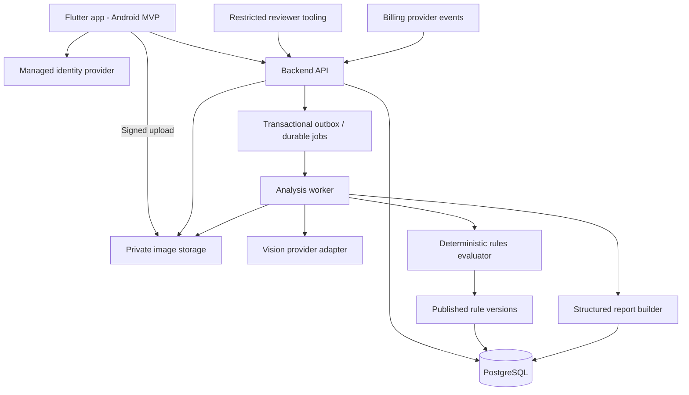
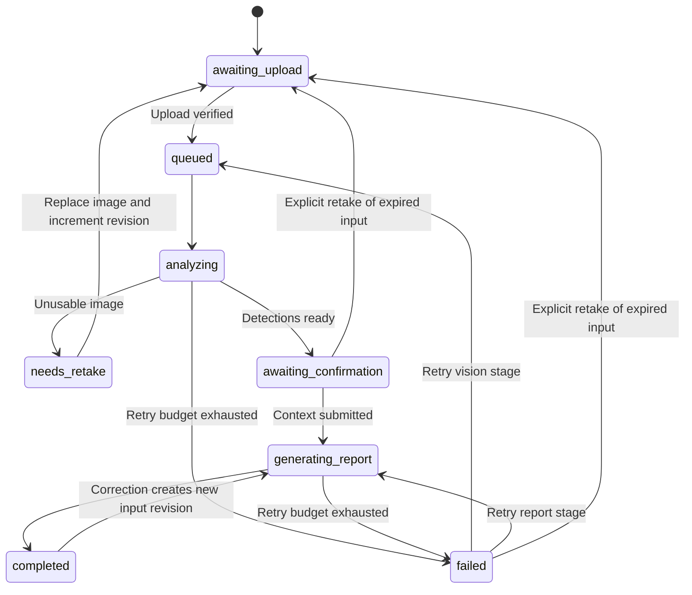

# Scan My Mandir — Application Architecture

**Version:** 1.4  
**Date:** 26 September 2026  
**Status:** Proposed implementation architecture  
**Platform:** Flutter (Dart), Android first; iOS planned  
**Inputs:** `Scan_My_Mandir_PRD.md`, `PRD_REVIEW.md`

This document defines how to implement the PRD. Recommendations and provisional operating targets below are design decisions, not measured results or approved changes to product scope. The PRD remains the source of product requirements; this document resolves implementation ambiguities and identifies decisions to validate before release.

## 1. Architecture decisions

| Area | Recommended decision | Reason |
|---|---|---|
| Mobile framework (confirmed) | Flutter with Dart; Android MVP, iOS later | User-approved framework with shared UI and application logic |
| App structure | Flutter widgets → controllers/state → use cases → repositories | Keeps UI separate from network, storage, and scan logic |
| Backend | TypeScript with Fastify; modular monolith | One codebase and clear modules without early microservice overhead |
| Background processing | Separate worker process from the same backend repository | Vision calls should survive app closure and HTTP timeouts |
| Database | PostgreSQL | Transactional scan state, rule versions, ownership, and entitlements |
| Queue | PostgreSQL-backed durable jobs with transactional outbox | Avoids a separate Redis service at launch; enqueue and state changes stay consistent |
| Images | Private S3-compatible object storage | Short-lived signed transfers and independent image retention |
| Identity | Managed identity provider with anonymous sessions and account upgrade | Enables guest-first scanning and secure ownership |
| AI | Provider adapter behind a validated vision contract | Allows model changes without changing app/report contracts |
| Religious guidance | Reviewed, versioned rules evaluated in code | Model output cannot create religious rules |
| Reports | Persisted structured snapshots; localized templates | Reproducible findings and consistent Hindi/English wording |
| Hosting | Managed containers, managed PostgreSQL, private object storage | Simple staging/production operations |
| Payments | Flutter store-billing adapter plus server-side entitlement verification | Android store integration first; iOS integration when that release is scoped |

Exact hosting, identity, and vision vendors remain implementation choices. Do not select a vendor based on assumed current pricing or SDK behavior; check its documentation and data handling before integration. Redis is optional later if queue throughput or caching measurements justify it.

The first evaluation candidate is `openai/gpt-6-luna` through an OpenRouter adapter, as recorded in PRD section 25. Keep model ID, reasoning configuration, and output budget server-configurable and persist the actual provider/model/usage with each attempt. Production selection depends on reviewed-photo evaluation and billed cost, not this candidate designation.

## 2. System overview



The API and worker share domain code but run as separate processes. The rules evaluator and report builder are modules, not separately deployed services. The app never receives AI provider credentials or direct database access.

## 3. Product boundaries and delivery order

### First working vertical slice

Guest session → camera/gallery → image quality gate → editable detections → context confirmation → reviewed guidance → report → save/delete.

Support Hindi and English from the first slice. The first slice is an internal delivery milestone, not a silent reduction of the PRD's launch scope.

### Subsequent implementation milestones

1. Saved mandir profiles and account upgrade/sync.
2. Direction questionnaire, compass capture, and applicable Vastu rules.
3. Free quotas, premium entitlements, purchase restoration, and paywall.
4. Launch analytics, operational controls, deletion verification, and release readiness.

Puja Guides, whole-house analysis, consultation, commerce, and other roadmap products are later work. The current PRD includes compass and billing in the public MVP; optional compass means users can skip it. Implement them after the core vertical slice. Deferring either from launch requires an explicit PRD scope change.

## 4. Flutter application

### Module layout

```text
mobile/
  pubspec.yaml            Flutter dependencies, assets, SDK constraints
  lib/
    main.dart             Bootstrap and environment configuration
    app/                  App widget, navigation, dependency wiring
    core/
      model/              Shared Dart domain models
      network/            API client, auth headers, error mapping
      database/           SQLite cache and migrations
      designsystem/       Reusable Flutter widgets and typography
      platform/           Camera, direction, secure storage, billing adapters
    l10n/                 Hindi/English localization resources
    features/
      onboarding/
      home/
      capture/
      scan/               Progress, detections, corrections, context
      report/
      history/
      mandir/
      direction/
      billing/
      settings/
  assets/
  android/                Android host, permissions, signing configuration
  ios/                    iOS host configuration for the later release
```

Use one Flutter application initially. Within substantial features, separate `presentation/`, `domain/`, and `data/`. Keep shared domain logic in Dart without Flutter or plugin dependencies. Extract reusable Dart packages only when a real need appears.

Widgets render state and dispatch user actions. Controllers coordinate use cases; repositories own remote/local data access. Choose one consistent state-management approach during scaffolding. Plugin selection and exact SDK versions remain implementation decisions and must be checked against current documentation before pinning dependencies.

### Platform integrations

Define interfaces for camera/gallery, heading capture, credential storage, billing, and background transfer. Implement them using maintained Flutter plugins where suitable; use platform channels only for unsupported native capabilities. Keep plugin-specific types outside the domain and report models.

Android is the MVP release target. Shared Dart code does not remove the need for iOS-specific permissions, signing, lifecycle handling, billing verification, and device validation before an iOS release. Heading capture must expose accuracy/unavailable states, not just a numeric sensor reading.

### State and persistence

- Dart controllers expose immutable loading, content, recoverable-error, and terminal-error states.
- Backend scan state is authoritative. A SQLite-backed Flutter repository caches reports, profile summaries, and in-progress scan IDs.
- Persist transfer/scan state before backgrounding. Use an OS-backed scheduling adapter for upload retry when supported; do not promise that Dart timers or isolates continue while the app is suspended. On foreground/resume, reconcile status with the backend. Analysis itself runs on the server.
- Camera captures use app-private temporary files. Gallery selection should request access only to chosen images.
- Request camera permission when opening the camera. A denied permission leaves gallery upload available.
- Never store auth secrets as plain SQLite fields. Use platform-backed secure credential storage through the identity integration and Flutter adapter.
- Clear cached images and reports on logout or deletion as appropriate to the user's action.
- Offline users can view cached reports; new analysis requires connectivity. Display cached report timestamps and sync state.
- Server deletion removes local copies on the next successful sync. An offline device cannot receive an immediate remote deletion; clear data immediately on the initiating device and disclose this boundary.

### Navigation

`Home → Capture/Upload → Preview → Analysis → Confirm Items → Context → Report`

Image quality and analysis progress are states within the scan flow. Finding detail and source detail open from a report. History, settings, and mandir profiles are secondary destinations.

## 5. Backend modules

| Module | Responsibility |
|---|---|
| Identity | Verify provider tokens, map subjects to internal users, anonymous-account linking |
| Scans | Ownership, lifecycle, idempotency, revisions, quota reservations |
| Media | Signed uploads, file validation, normalization, private retrieval, deletion |
| Vision | Provider invocation, timeouts, output parsing, schema validation |
| Context | User-confirmed detections, tradition, direction, and contextual answers |
| Knowledge | Rule versions, sources, review workflow, publication |
| Rules | Evaluate only applicable published rules against confirmed inputs |
| Reports | Build immutable report revisions with evidence and source references |
| Mandirs | Profiles and user-confirmed reusable context |
| Billing | Verified purchases, entitlements, quota ledger, restore/reconciliation |
| Privacy | Scan/account deletion jobs and retention policies |
| Operations | Health checks, audit events, metrics, alerts, administrative access |

Validate requests and responses against versioned schemas. Authorization applies to every object lookup, including images, findings, reports, and mandir profiles.

## 6. Scan pipeline

1. App creates a scan with an idempotency key. Server checks ownership and reserves any required scan allowance.
2. Server issues a short-lived upload URL scoped to that scan's object key and size constraints.
3. App uploads and confirms completion. Server verifies the stored object before enqueueing analysis.
4. Worker decodes the image, enforces resource limits, applies orientation, removes unnecessary metadata, and creates a normalized derivative.
5. Quality gate assesses blur, darkness, obstruction, and whether the image is relevant. Unusable input receives a retake action and no consumed allowance.
6. Vision adapter returns visual observations only. Schema validation rejects unsupported fields, invalid coordinates, and malformed responses.
7. Persist model observations and move the scan to `awaiting_confirmation`.
8. User confirms, changes, adds, or removes items and supplies applicable context. An explicit continue action can preserve uncertain items as unknown.
9. Server increments `input_revision` and queues report generation for that revision.
10. Rules evaluator filters by published status, tradition, required inputs, and exceptions. Unknown prerequisites produce `not_assessed`, never a presumed pass.
11. Report builder combines visual findings, applicable guidance, verification requests, and safety observations.
12. Commit a report only if the scan is not deleted and the job's input revision is still current. Consume the reserved allowance once on the first successful report.

### Revision and media ownership

- `image_revision` identifies immutable visual input; retake increments it. Observations and media refer to this revision.
- `input_revision` identifies an immutable analysis-input snapshot containing the image revision, observation references, corrected items, and context. Confirmation increments it without rerunning vision.
- Reports refer to the input snapshot and preserve the exact published rule/source content used. Corrections reuse valid observations from the same image revision.
- Upload into a unique staging key per attempt. At completion, validate and pin an immutable object version or copy to a server-only canonical key before analysis. Reuse of an unexpired upload URL must not modify input already analyzed.
- Once a photo expires, corrections may still change labels/context using retained structured evidence. Do not offer a new visual assessment or image overlay without retained image data. A new photo after completion creates a new scan.

Users may close the app at any point after upload. Reopening retrieves the existing scan; it does not start a second model call automatically.

### State machine



Any nondeleted state, including completed and failed, can transition to `deleted`; deletion is terminal and takes precedence over worker completion. Record the failed stage so retries resume correctly. Replaced images invalidate earlier observations and dependent reports. Reserve allowance atomically before restarting a released, unconsumed scan. Expired analysis input returns `IMAGE_EXPIRED` and requires retake before new vision work.

### Delivery guarantees

- Jobs may run more than once. Writes must be idempotent for `(scan_id, input_revision, job_type)`.
- A transaction records state and an outbox event together. A dispatcher claims and delivers jobs; a periodic reconciler catches abandoned leases.
- Transient provider failures retry with bounded exponential backoff and jitter. Invalid input and unsupported-image errors do not retry automatically.
- Worker leases expire after crashes. A repeated worker must check current revision and deletion status before publishing results.
- Client retries reuse the same idempotency key for the same operation. A new photo is a new operation/revision.
- Scope idempotency keys by owner and operation; persist request hashes and return a conflict if a key is reused with different input. Confirmation and report commit transactions check revision, deletion, job ownership, and quota state under the same scan lock.

## 7. Vision and rule contracts

### Normalized visual output

```json
{
  "schema_version": "1",
  "image_quality": {"usable": true, "reasons": []},
  "objects": [
    {
      "observation_id": "obs_001",
      "category": "deity_representation",
      "label": "ganesh",
      "representation_type": "statue",
      "group_id": null,
      "bounding_box": {"x": 0.1, "y": 0.2, "width": 0.2, "height": 0.4},
      "model_confidence": 0.82,
      "verification_required": true
    }
  ],
  "visual_findings": []
}
```

Coordinates are normalized to the oriented derivative, within `[0, 1]`, and must remain inside image bounds. Model confidence is an uncalibrated signal until evaluated; it is not a probability guarantee shown to users.

Use an explicit supported-label catalog plus `unknown`. Catalog label IDs are lowercase `snake_case`; the adapter normalizes each provider string into a catalog ID or `unknown`, and user-facing deity names come from localization resources rather than the raw model string. Track deity groups and their members to avoid counting one group scene twice. A framed image and statue are distinct representations. Material, size, hidden damage, and missing objects require suitable evidence or user input.

If a provider cannot localize objects reliably, omit the overlay and request label confirmation; do not manufacture bounding boxes.

### Rule record

Each published version contains:

`rule_id`, `version`, `category`, `tradition_ids`, `region_scope`, `required_inputs`, `condition`, `exceptions`, `source_version_ids`, `localized_explanation`, `localized_recommendation`, `reviewer_id`, `reviewed_at`, `published_at`, `lifecycle_status`.

Conditions use a restricted declarative operator set, not executable code from the database. The evaluator returns `applies`, `does_not_apply`, or `not_assessed` with reasons. Conflicting applicable traditions remain separately attributed; do not invent a universal resolution.

LLMs do not author runtime rules. MVP explanations come from reviewed Hindi/English templates. A future paraphrasing layer must preserve approved meaning and source linkage, with a template fallback.

Treat uploaded image text and model output as untrusted input. Neither can modify instructions, call tools, publish rules, or access secrets.

## 8. Context and direction

Store three independent inputs:

| Field | Meaning | Collection |
|---|---|---|
| `worshipper_facing_direction` | Direction the person faces while worshipping | Explicit questionnaire or guided compass capture |
| `idol_facing_direction` | Direction the front of the idol faces | Separate user confirmation |
| `mandir_location_in_home` | Mandir's position relative to the home | User context; not inferred from phone heading |

Direction records contain `measurement_kind`, `degrees` when measured, `cardinal_direction`, `input_method`, `accuracy_status`, `confirmed_at`, and optional sensor quality information. Do not silently convert one kind into another. Explain how to hold the phone before capture.

No sensor, interference, or unknown direction must leave the visual report usable. Vastu rules run only after their specific inputs are supplied. A stored profile direction is editable and must be confirmed as relevant for a new scan.

## 9. Data model

All user-owned records use internal UUIDs, timestamps, and ownership constraints. Use foreign keys and transactions for relationships; possession of a UUID is not authorization.

| Table | Main fields / constraints |
|---|---|
| `users` | Identity subject (unique), anonymous/registered status, language, deletion status |
| `mandirs` | User ID, display name, tradition selection, current context revision |
| `scans` | User ID, optional mandir ID, status, image/input revisions, failed stage, idempotency key, deletion timestamp |
| `media_objects` | Scan ID, image revision, immutable storage key/version, purpose, validation status, retention deadline |
| `observations` | Scan/image revision, immutable model label, representation type, group ID, optional box/confidence |
| `scan_input_versions` | Scan/input revision, image revision, observation references, confirmed-item/context snapshot |
| `confirmed_items` | Scan/revision, observation reference when present, corrected label, confirmation state |
| `scan_context` | Scan/revision, explicit answers, tradition IDs, direction measurements |
| `sources` / `source_versions` | Stable identity plus immutable title, reference/URL, edition/section, attribution and review versions |
| `rules` | Stable identity and topic |
| `rule_versions` | Content immutable after publication; versioned conditions, translations, source-version links and audited lifecycle transitions |
| `reports` | Scan ID, report revision, input revision, model/prompt/schema versions, generation time |
| `findings` | Report ID, finding type, status, priority, observation evidence, optional rule version, content stored for every supported language |
| `report_rule_evaluations` | Report ID, evaluated rule version, outcome and missing-input reasons |
| `jobs` / `outbox` | Deduplication key, payload references, stage, attempts, lease, next run time |
| `entitlements` | User ID, verified product, provider reference, status, expiry |
| `quota_ledger` | User/scan, allowance period, reserve/consume/release, unique operation key |
| `feedback` | Report revision, usefulness selection, optional issue type |
| `deletion_requests` | Scope, owner, requested time, processing state, completion time |
| `audit_events` | Administrative actor, action, target/version, timestamp; no image contents |

Report revisions are immutable snapshots. Corrections create a new version and preserve history until user deletion/retention cleanup. Snapshot the exact rule version and source attribution used so editing a rule does not rewrite old advice.

## 10. API surface

All endpoints below are proposed contracts under `/v1`. Authentication uses verified identity tokens; do not build a parallel password database. Return stable machine-readable error codes and localized client messaging.

| Method / path | Purpose |
|---|---|
| `GET /me` | Current profile, language, quota, entitlements |
| `PATCH /me` | Update supported profile preferences |
| `DELETE /me` | Request account and owned-data deletion |
| `POST /scans` | Create scan and reserve quota; accepts idempotency key |
| `POST /scans/{id}/upload-url` | Get constrained signed upload URL |
| `POST /scans/{id}/upload-complete` | Validate object and enqueue analysis |
| `POST /scans/{id}/retake` | Reset rejected/expired pre-completion input, increment image/input revisions and reserve allowance if released; checks expected revision |
| `GET /scans/{id}` | State, current revision, next action, safe failure code |
| `GET /scans` | Cursor-paginated history |
| `GET /scans/{id}/detections` | Observations and current corrections |
| `PUT /scans/{id}/confirmation` | Submit item corrections and context atomically, then generate report |
| `POST /scans/{id}/retry` | Retry permitted failed stage without duplicate quota use |
| `GET /scans/{id}/report` | Latest complete report and whether newer work is pending |
| `GET /reports/{id}` | Read an owned immutable report revision referenced by history or feedback |
| `GET /scans/{id}/media/{mediaId}/url` | Issue signed read URL for retained validated media after ownership/deletion checks; return unavailable after expiry |
| `DELETE /scans/{id}` | Revoke access and schedule physical deletion |
| `POST /reports/{id}/feedback` | Submit usefulness/issue feedback |
| `GET /sources/{id}?version={version}` | Exact published source metadata referenced by a report |
| `POST /mandirs` | Create a profile |
| `GET /mandirs` | List owned profiles |
| `PATCH /mandirs/{id}` | Update profile/context |
| `DELETE /mandirs/{id}` | Delete profile; require explicit choice for associated scan deletion |
| `POST /billing/verify` | Validate purchase and refresh entitlement |
| `POST /billing/restore` | Reconcile verified owned purchases |
| `POST /billing/events` | Authenticated provider event ingestion; deduplicate events |

Confirmation writes include `expected_input_revision`; return a conflict for stale edits. Signed report-image URLs are issued only after ownership/deletion checks. Poll scan state with bounded backoff while visible; push notifications are optional later.

Typical errors: `IMAGE_UNUSABLE`, `IMAGE_EXPIRED`, `UPLOAD_INVALID`, `QUOTA_EXCEEDED`, `ANALYSIS_UNAVAILABLE`, `REVISION_CONFLICT`, `RESOURCE_DELETED`. Do not return raw provider responses or internal exception details.

Report sharing uses a local export and the platform share sheet initiated by the user. Do not create public image/report URLs by default. Include a photo only if retained and explicitly selected in the preview.

## 11. Report contract and presentation

Each finding has independent fields for:

- **Type:** visual, traditional, Vastu, safety, or verification.
- **Status:** looks_good, review, or verify.
- **Priority:** normal or safety_attention.
- **Evidence:** observation IDs, confirmed context, and rule/source version where applicable.
- **Content:** what was observed, why it matters, suggested action, and uncertainty.

Show item counts separately from finding counts; one item can support several findings. A whole-scene finding need not belong to one object. “Looks good” applies only to the visible assessed condition.

Safety findings and basic attribution remain visible in free reports. Premium may add depth or capabilities; entitlement filtering must not remove the evidence needed to interpret a displayed claim.

Generate and persist every supported language for a report revision at build time. Changing the app language re-renders the stored revision and must not trigger regeneration, a new revision, or quota consumption. Adding a language later is an explicit backfill that must not alter the findings or evidence of existing revisions.

## 12. Privacy, security, and retention

### Required controls

- TLS in transit, encrypted managed storage, private buckets, short-lived signed URLs.
- Validate actual decoded image type, dimensions, and resource usage rather than trusting extension/MIME headers.
- Enforce authorization, per-user limits, and abuse controls for anonymous sessions.
- Store provider credentials only in the server secret manager. Redact signed URLs, tokens, photos, and sensitive context from logs.
- Restrict reviewer/admin routes with separate roles and strong authentication; audit rule publication.
- Use customer images/corrections for model training only under a separate explicit opt-in flow.
- Ensure deletion also prevents queued work or late provider responses from restoring data.
- Reject uploads that are illegal or clearly outside the product's purpose at the validation and quality gate. Record the rejection reason without retaining the content beyond a defined short review window. Any human review of a user photo requires a restricted, audited role and must be disclosed in the privacy notice.
- Treat applicable data-protection obligations as a launch dependency. For the India-first release this includes a plain-language consent notice before the first upload, a published grievance contact, a working deletion path, and an explicit decision on under-18 users. Confirm scope through qualified legal review; this document is not legal advice.

### Proposed retention defaults — validate before launch

| Data | Proposed lifetime |
|---|---|
| Original upload and analysis derivative | Delete within 24 hours after terminal processing; hard cap of 7 days for abandoned/incomplete scans |
| History thumbnail | Persist only if user explicitly chooses to save the photo; otherwise report history is text-only |
| Structured report and confirmed context | Until user deletion/account deletion, subject to a published inactive-account policy |
| Operational logs without image content | 30 days |
| Backups | Rolling 30-day expiry; deletion ledger reapplied before a restored system serves traffic |

After image expiry, release unconsumed reservations for abandoned scans and mark image-dependent work unavailable. Persist existing observations so text confirmation/report generation can resume with a fresh reservation if required. A saved thumbnail is not automatically sufficient for rerunning vision. Keep the deletion ledger outside rollback scope for at least the backup restoration window, minimize its identifiers, and reapply it before restored services accept requests.

On delete, immediately tombstone and deny access, then complete primary-store cleanup within a proposed 24-hour target. Short-lived URLs already issued expire within a proposed 5 minutes. Provider-side retention must be checked separately and disclosed; our object deletion does not establish provider deletion.

Guest users must be told that cross-device recovery requires account upgrade. Anonymous ownership linking must be atomic and must never merge histories based only on an email string supplied by the client.

## 13. Quotas and billing

PRD section 30 now records ₹49/month and a ₹49 limited premium-credit pack as alternative pricing experiments. No paid offer has been selected. The current subscription architecture remains the documented baseline; a pack-only launch requires a coordinated scope update. If packs are selected, extend the ledger with purchase-linked credit grants and reserve/consume/release/refund events, distinguish them from monthly free allowances, and define credit validity, consumption order, recovery, and revocation before implementing the offer. A basic-report upgrade must be an explicit priced operation with its own deduplication key; ordinary corrections must not consume premium credits automatically.

- Keep plans, allowances, and premium feature flags in server configuration. PRD pricing is a hypothesis, not a hard-coded architectural constant.
- Proposed free quota: three successful scans per calendar month in one server-configured timezone, with the reset date shown to the user. Proposed default is Asia/Kolkata so the displayed reset matches the India-first audience's local month. Store the resolved period boundaries with each reservation; never derive the period from a device clock or device timezone.
- Reserve allowance before paid provider work. Consume only once when the first report succeeds; release on terminal failure or unusable input.
- Corrections and report regeneration for the same photo do not consume another allowance. Apply separate abuse limits to repeated requests.
- A new photo after a successful scan is a new scan. Rejected input releases its reservation; retake/retry must atomically acquire a new reservation before new billable work. Never consume a released reservation.
- Reservations carry their allowance period and expiry. Proposed expiry is 24 hours; a reconciler renews leases for active queued/running work and releases idle upload/confirmation reservations. Resuming after release rechecks current allowance. Consume against the reservation's period; hold report commit if a required reservation is unavailable. Never charge twice for an already-consumed scan.
- Verify purchases on the backend, deduplicate provider events, and reconcile expiry/refund/revocation state.
- Bind each verified purchase to one internal user and reject attempts to claim it for a different user without an authenticated account-linking flow. Use verified provider state/event ordering during reconciliation, not client timestamps.
- Support restoration. Existing basic reports remain readable after expiry; new premium operations require an active entitlement. Final free-history depth and premium allowances must be specified before billing launch.

## 14. Deployment and operations

```text
Production
  Flutter Android app
  API container service
  Worker container service
  Scheduled dispatcher / retention / reconciliation jobs
  Managed PostgreSQL with automated backups
  Private object storage
  Secret manager
  Central logs, metrics, crash reporting, alerts

Staging
  Same service layout with separate credentials, database, storage, and billing sandbox
```

Run migrations as a controlled deployment step. Prefer additive migrations compatible with the previous API/worker version before removing old fields. Release API changes compatibly with already-installed Android versions.

Monitor queue age, worker failures, provider latency, schema-invalid responses, scan completion, estimated cost per scan, quota mismatches, deletion backlog, and report usefulness. Use correlation IDs rather than logging images or full prompts.

Feature flags should independently disable new scans, a failing vision provider, Vastu, billing offers, or a problematic rule version. Existing reports should remain accessible during an AI outage. Rule rollback stops new evaluations without changing historical snapshots.

## 15. Provisional engineering targets

These are initial budgets to evaluate with real images and chosen infrastructure, not service guarantees.

| Measure | Initial target |
|---|---|
| Non-upload API latency | p95 under 500 ms, excluding provider work |
| Vision stage | p95 under 30 seconds after a valid upload, measured separately from queue wait |
| Report generation after confirmation | p95 under 5 seconds with deterministic templates |
| Upload limit | 10 MB and 25 megapixels; reject unsafe decode sizes |
| Provider call timeout | 45 seconds; at most two automatic retries for transient failures |
| Signed URL lifetime | 5 minutes |
| Scan concurrency | One active analysis per guest initially; configurable registered-user limits |

Detection acceptance thresholds and per-scan monetary budgets require a reviewed sample set and vendor evaluation. Do not declare release readiness from model confidence scores alone.

## 16. Validation plan

Before release, validate the following behaviors:

1. Supported labels, group counting, unknown objects, poor photos, and non-mandir images using a reviewed evaluation set.
2. Rule applicability, unknown prerequisites, exceptions, conflicts, source links, and Hindi/English meaning.
3. Corrections invalidate stale findings; stale workers cannot overwrite newer report revisions.
4. Duplicate requests and worker retries produce one quota consumption.
5. Cross-user access to scans, media, and reports is denied.
6. Deletion during analysis prevents late publication and completes retention cleanup.
7. App closure, network loss, denied camera access, and unavailable compass sensors have recoverable flows.
8. Billing restoration, expiry, refunds, duplicate events, and out-of-order events reconcile correctly.
9. Backup restoration reapplies deletions and preserves report/rule version references.

### Automated test layers

Build these alongside the features rather than at the end:

- Dart unit tests for controllers, state transitions, and model mapping; widget tests for scan, report, and error states; one integration test covering the core journey against a fake backend.
- Backend unit tests for rule evaluation outcomes, quota accounting, and schema validation; integration tests against a real PostgreSQL instance for revision conflicts, idempotency, worker leases, and ownership checks.
- Recorded vision-adapter fixtures so provider changes and malformed responses are testable without live provider calls or real user photos.
- Rule fixtures that must pass before a rule version can be published.

Duplicate-request, retry, and stale-revision behavior cannot be established by manual testing alone; those need automated concurrent tests.

These are planned checks; no app implementation or test execution accompanies this architecture document.

## 17. Suggested repository layout

```text
Scan My Mandir/
  ARCHITECTURE.md
  Scan_My_Mandir_PRD.md
  PRD_REVIEW.md
  mobile/                Flutter app; lib/, test/, assets/, android/, ios/
  backend/
    src/
      api/
      worker/
      modules/
        identity/
        scans/
        media/
        vision/
        context/
        knowledge/
        rules/
        reports/
        mandirs/
        billing/
        privacy/
      shared/
    migrations/
    test/
  contracts/             API schemas, label catalog, report schemas
  knowledge/             Reviewed source metadata and rule authoring fixtures
  infra/                 Container definitions and deployment configuration
  docs/                  Decisions, operational runbooks, evaluation criteria
```

## 18. Decisions to settle during implementation

| Decision | Default for planning | Must be settled before |
|---|---|---|
| Flutter SDK and integration packages | Flutter/Dart confirmed; pin compatible versions and choose one state-management approach | App scaffolding |
| Identity provider and account methods | Guest-first, managed identity | Auth integration |
| Vision provider/model | Adapter-based evaluation | Real-photo integration and privacy notice |
| Hosting region/vendor | Managed services in one selected region | Infrastructure provisioning |
| Initial reviewed traditions and rules | Small, explicitly supported set | Any traditional report release |
| Compass and subscriptions | In documented public MVP, implemented after the core vertical slice; any deferral requires a PRD change | Release scope confirmation |
| Retention and save-photo behavior | Proposed defaults in section 12 | Production data collection |
| Quota reset timezone | Asia/Kolkata, fixed in server configuration | Quota display and billing activation |
| Rejected-upload handling and review role | Gate-level rejection with no routine human review | Production data collection |
| Pricing and premium limits | Configurable, validated experimentally | Billing activation |

No answer is required to review or use this document. These defaults allow design work to proceed while keeping spending, provider selection, and final launch scope explicit.
