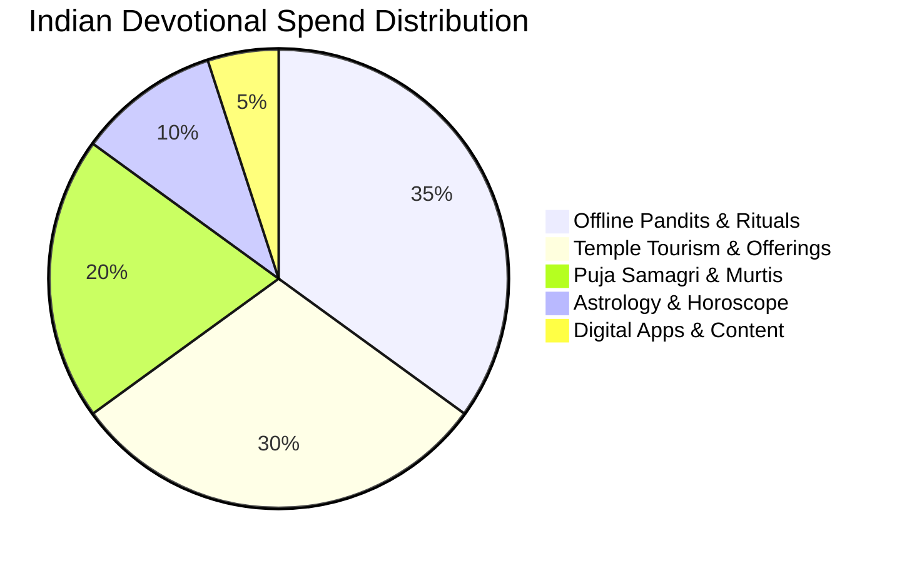
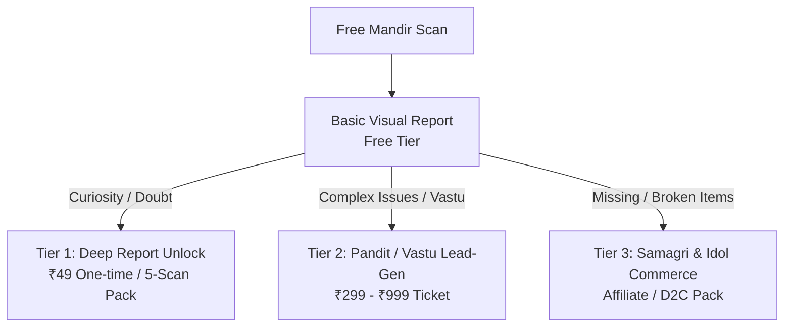

# Scan My Mandir — Market Demand & Strategic Feasibility Analysis

**Date:** 26 September 2026  
**Document Type:** Commercial & Strategic Feasibility Assessment  
**Subject:** Market Demand, Unit Economics, and Growth Strategy for "Scan My Mandir"  
**Related Documents:** `Scan_My_Mandir_PRD.md`, `ARCHITECTURE.md`, `TASKS.md`

---

## 1. Executive Summary

"Scan My Mandir" addresses a widespread, culturally deep-rooted curiosity in Indian households: *“Kya hamare ghar ke mandir ki vyavastha aur disha parampara aur Vastu ke anusaar theek hai?”*

### Strategic Reality
- **Organic Demand & Top-of-Funnel Interest:** **Very High.** Queries around idol placement, duplicate idols, broken idols, and mandir Vastu generate millions of high-intent searches each month across Google, YouTube, and Hindi digital print.
- **Standalone Utility Frequency:** **Low (Episodic).** Mandirs are altered only during milestones: moving into a new home (Griha Pravesh), major festivals (Diwali, Navratri), or when replacing sacred items.
- **Commercial Conclusion:** The app cannot survive solely on a recurring subscription model (₹49–₹99/month) due to steep Day-30 churn. However, as an **acquisition wedge** (zero-CAC organic hook) that converts into one-time reports, expert consultations (Vastu/Pandit), and authentic spiritual commerce, the market opportunity is significant within India's $40B+ spiritual ecosystem.

---

## 2. Indian Faith-Tech Ecosystem Overview

India’s spiritual, devotional, and religious economy is valued at approximately **$40B–$50B annually**, largely unorganized and offline:

### Digital Devtech Landscape
1. **Daily Habit Apps (AppsForBharat / Sri Mandir, Vama, DevDarshan):**
   * *Value proposition:* Daily digital aarti, panchang, chalisas, and temple darshan.
   * *Monetization:* E-puja booking at renowned temples, digital chadhava/donations.
2. **Consultation Marketplaces (Astrotalk, Guruji):**
   * *Value proposition:* Instant answers to personal distress and future anxiety.
   * *Monetization:* Pay-per-minute audio/video calls (₹20 to ₹150/minute). High LTV, aggressive paid acquisition.
3. **Scan My Mandir Positioning:**
   * Bridges the gap between **static informational blogs** and **expensive Pandit consultations** via computer vision and structured explainability.

---

## 3. Demand Drivers & Consumer Intent Analysis

### 3.1 Organic Search Demand (High Intent)
Every month, over 2.5M+ searches take place across tier 1, 2, and 3 cities around home mandir queries:

| Search Category | Example Queries (Hinglish / Hindi) | Volume Intent |
|---|---|---|
| **Idol Placement** | *“Ghar ke mandir me kaun si murti kahan rakhein”* | High (Informational) |
| **Duplicates & Limits** | *“Ek mandir me do Ganesh ji ki murti rakhna chahiye ya nahi”* | High (Doubt / Anxiety) |
| **Damaged Objects** | *“Khandit murti ka kya karein”, “Tuta hua diya use karein?”* | High (Action-oriented) |
| **Direction & Vastu** | *“Ghar me mandir ki sahi disha”, “Pooja room Vastu tips”* | Very High (Commercial intent) |
| **Deity Specifics** | *“Ghar me shivling rakhne ke niyam”, “Hanuman ji murti”* | High (Tradition-specific) |

### 3.2 Cultural & Emotional Triggers
* **Anxiety of Doing Something Wrong:** Devotees fear inadvertently inviting misfortune or disrespecting deities by violating tradition.
* **Lack of Authoritative Family Elders in Nuclear Families:** Urbanization and nuclear family structures leave younger householders without elderly guidance for setting up a puja space.
* **Information Overload & Conflicting Content:** Internet forums and YouTube channels present conflicting views without verifiable source citations.

---

## 4. The Core Challenge: The Frequency Problem

The primary structural risk for Scan My Mandir is the mismatch between **frequency of need** and **subscription monetization**:

| Metric | Habitual Apps (Sri Mandir) | Episodic Scanner (Scan My Mandir) |
|---|---|---|
| **Use Frequency** | Daily / Weekly | 1 to 2 times a year |
| **Retention (D30)** | 25% – 40% | < 5% |
| **Natural Triggers** | Morning puja, festivals | Shifting home, Diwali cleaning, new idol buy |
| **Subscription Feasibility** | Viable (content/features) | **Unviable** (90%+ immediate churn) |

### Why Monthly Subscriptions Will Struggle
A user scans their home mandir, reads the report, reorganizes items once, and has no reason to run another scan for the next 6 to 12 months. Charging ₹49/month requires an ongoing value proposition that a one-time photo analysis does not deliver.

---

## 5. Recommended Monetization Strategy

To build a sustainable business, monetization must align with the episodic nature of home improvement:

### 5.1 Tier 1: One-Time Premium Report Unlock (Low Friction)
* **Offer:** ₹49 one-time payment (or a ₹49 pack of 3–5 scans).
* **Deliverable:**
  * Complete Vastu compass analysis.
  * Deep traditional-practice rationale with textual source citations.
  * Downloadable / shareable branded PDF report (optimized for WhatsApp family sharing).

### 5.2 Tier 2: Expert Consultation Marketplace (High Margin)
* **Problem Identified:** The app reports: *“Mandir placement in South-West requires expert evaluation.”*
* **Solution:** One-click connect with a verified Vastu expert or Pandit (15-min call for ₹299–₹499).
* **Take Rate:** 25% – 35% commission per booking.

### 5.3 Tier 3: Curated Puja Samagri & Authentic Murtis (Commerce)
* **Contextual Triggers:**
  * App detects broken diya $\rightarrow$ Prompt: *“Replace with authentic brass diya.”*
  * App detects missing Shankh/Gangajal $\rightarrow$ Direct fulfillment via trusted suppliers.
* **Affiliate or D2C Margin:** 15% – 40%.

---

## 6. Acquisition & Go-To-Market (GTM) Playbook

Because paid customer acquisition (Meta/Google App Install Ads at ₹30–₹60 CAC) would break unit economics on a ₹49 product, acquisition must rely on low-cost channels:

### 6.1 SEO Content Engine (The Organic Funnel)
Deploy a lightweight content hub around exact search queries:
* `/khandit-murti-ke-niyam`
* `/ek-mandir-me-do-ganesh-ji`
* `/mandir-vastu-sahi-disha`
* Each article features an interactive call-to-action: **“Apne mandir ki photo upload karke check karein.”**

### 6.2 The "Family WhatsApp" Virality Loop
* Allow users to generate a neat, respectful visual report card:
  * *“Hamare ghar ke mandir ka scan complete — 9 Traditional checks passed!”*
* Indian family WhatsApp groups thrive on devotional content. A non-judgmental, aesthetically pleasing report graphic creates a strong peer-to-peer referral loop.

### 6.3 Seasonal Event Campaigns
Concentrate marketing efforts around calendar spikes:
1. **Diwali Pre-Cleaning (October/November):** Major mandir renovation and cleaning period.
2. **Navratri (Chaitra & Sharad):** Setup of Ghatasthapana and special altars.
3. **Janmashtami & Ganesh Chaturthi:** Setup of temporary puja pandals and idol placements.

---

## 7. Product-Market Fit Scorecard

| Dimension | Rating | Commentary |
|---|:---:|---|
| **Consumer Curiosity** | 🟢 9/10 | Universal curiosity across Hindu households globally. |
| **Search Intent & Organic Pull** | 🟢 9/10 | Very high query volumes; answers are currently fragmented. |
| **Willingness to Pay (Micro-transaction)** | 🟡 6/10 | Users will pay ₹49 for certainty, but resistant to subscriptions. |
| **Usage Frequency** | 🔴 3/10 | Highly episodic; requires multi-service expansion for retention. |
| **Technical Defensibility** | 🟢 8/10 | Sourced knowledge base + computer vision forms a high moat. |

---

## 8. Strategic Recommendations for the Founders

1. **Drop Recurring Subscriptions from MVP:**
   Replace the ₹49/month subscription with a **₹49 single scan unlock** or **₹49 / 3-scan credit bundle**. Do not ask users for recurring payment commitments for an episodic action.
2. **Double Down on Shareability:**
   Make the report exportable as a high-quality WhatsApp status / image card with clear branding and download links.
3. **Maintain Strict Ethical Boundaries:**
   Never pivot to fear-based messaging (*“Your mandir has dosha, buy this remedy”*). Long-term defensibility depends entirely on being the most trusted, objective, and culturally authentic guide.
4. **Treat the Scanner as a Wedge:**
   View the image scan not as the terminal product, but as the proprietary top-of-funnel technology that captures high-intent households for higher-ticket services (consultations and authentic devotional goods).
