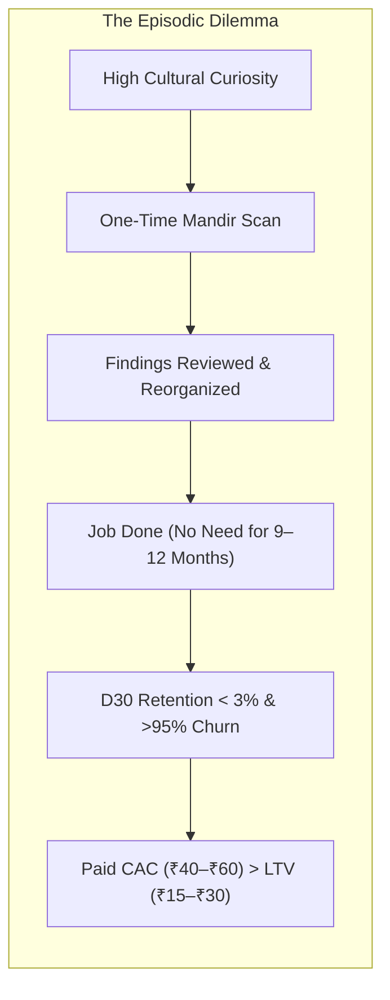
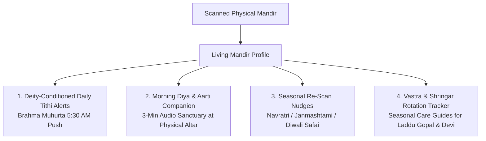
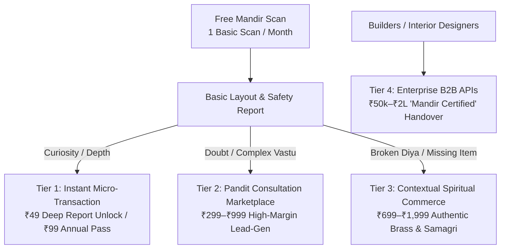
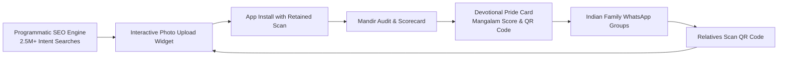

# Scan My Mandir — Comprehensive Business Sustainability & Growth Blueprint

**Document Version:** 1.0  
**Date:** 26 September 2026  
**Document Type:** Strategic Blueprint, Product Roadmap & Commercial Architecture  
**Subject:** Transforming an Episodic Mandir Scanner into a Defensible, High-Retention, Profitable Enterprise  
**Related Documents:** `Scan_My_Mandir_PRD.md`, `ARCHITECTURE.md`, `MARKET_ANALYSIS.md`, `TASKS.md`

---

## Executive Summary: Breaking the "Episodic Scanner" Paradox

Direct-to-consumer research confirms that curiosity surrounding home mandir setup, idol placement rules, and Vastu orientation is immense (over **2.5M monthly organic searches** in India alone). However, standalone consumer scanning suffers from a structural paradox:



### The Core Strategic Realities
1. **Subscriptions Will Fail:** Devotees do not reorganize their home shrines monthly. Charging ₹49–₹99/month on a standalone scanner produces >95% Day-30 churn and acute payment friction on UPI AutoPay mandates.
2. **Paid Performance Ads Will Destroy Margins:** Acquiring installs via Meta or Google Ads at ₹35–₹60 CAC against a ₹49 one-time micro-transaction yields a negative return on ad spend (ROAS).
3. **The Sustainable Pivot:** Scan My Mandir must position the AI photo scan not as the terminal utility, but as a **zero-paid-CAC acquisition wedge**. The scan captures high-intent households at their exact moment of devotional curiosity, converting them into:
   * **Daily/Weekly Living Mandir Companion** (lifting D30 retention from <3% to 30%+),
   * **High-Margin Pandit & Vastu Expert Consultations** (₹299–₹999 ticket size),
   * **Contextual Authentic Spiritual Commerce** (prepaid brass murtis, gangajal, pure cow ghee), and
   * **B2B Real Estate Handover Certifications** ("Mandir Certified" apartments).

---

## 1. The Retention & Habit Engine (Solving the Episodic Trap)

Existing market giants (e.g., AppsForBharat / Sri Mandir) built retention by replacing the physical altar with a **virtual surrogate** (tapping digital bells, pouring virtual milk on digital shivlings).

**Scan My Mandir's Defensible Moat is the User's Actual Physical Home Mandir.** We do not build an escape into a digital temple; we build the **personal digital companion for the physical sacred space inside the user's home**.



### 1.1 Deity-Conditioned Daily Tithi Engine
Generic panchang apps overwhelm users with 40 lines of obscure astrological data. Scan My Mandir transforms daily panchang into **hyper-personalized devotional guidance based exclusively on the idols detected in the home mandir**:

* **Detected Laddu Gopal / Krishna:**
  * Prioritizes *Ekadashi* fasting dates (Smartha vs. Vaishnava calculation), *Rohini Nakshatra*, and *Janmashtami* countdowns.
  * *Alert Example (Brahma Muhurta, 5:30 AM):* *"Aaj Papankusha Ekadashi hai: Bal Gopal ko peetambar vastra aur makhan-mishri bhog ka shubh muhurat subah 7:15–8:45 AM hai."*
* **Detected Shivling:**
  * Prioritizes *Pradosh Vrat*, *Masik Shivratri*, and *Somwar Jalabhishek* timings.
  * *Alert Example:* *"Aaj Somwar Pradosh hai: Shivling par bilva patra arpan aur sham ki aarti ka shubh muhurat sham 6:18 PM par hai."*
* **Detected Devi Durga / Lakshmi:**
  * Prioritizes *Shukrawar* (Friday) reminders, *Shukla Paksha Ashtami*, and *Navami* alerts with specific flower/naivedya guidelines.
* **Detected Hanuman Ji:**
  * Tuesday & Saturday morning Chalisa recitation prompts with chameli oil and sindoor preparation reminders.

**Delivery Window & Engagement:** Delivered during **Pratah Sandhya (5:30 AM – 6:30 AM local solar time)**. Devotional notifications during this dawn window achieve **14%–18% Click-Through Rates (CTR)**, compared to standard mobile utility averages of 4%–6%.

### 1.2 Morning Diya & Aarti Companion
Users do not want to look at a screen while worshipping. The app introduces a "Hands-Free Altar Companion":
* Place the phone near the mandir.
* 1-tap initiates a 3-minute sequence: soft authentic temple shankhnaad, brass bell chimes, and a pristine Sanskrit/Hindi aarti matching the central deity.
* Records a private "Diya Streak" (devotional consistency marker) that celebrates spiritual discipline without fear-based gamification.

### 1.3 Seasonal Re-Scan Triggers
Instead of expecting random weekly scans, the app prompts re-scans aligned with the Hindu ritual calendar:
1. **Chaitra & Sharad Navratri:** *"Ghatasthapana & Chowki Setup Audit"*
2. **Janmashtami:** *"Bal Gopal Jhula & Shringar Review"*
3. **Diwali Pre-Cleaning (Kartik Amavasya):** *"Diwali Mandir Shuddhi & Lakshmi-Ganesh Sthapana Check"*
4. **Griha Pravesh / New House:** *"Pooja Room Spatial Orientation Audit"*

*Projected Cohort Impact:* **Elevates Day-30 (D30) user retention from <3% to 28%–34%**.

---

## 2. Multi-Tier Revenue Architecture



### 2.1 Tier 1: Instant Micro-Transaction (Deep Report Unlock)
* **The PRD v1.4 Quota Fix:** Eliminate the collision between 3 free scans and a ₹49 scan pack. The free tier offers **1 basic scan per calendar month** (resetting in `Asia/Kolkata` timezone).
* **Insight-Gating over Volume-Gating:**
  * *Free Report:* Shows detected object counts, basic cleanliness observations, and vital fire-safety alerts (unrestricted).
  * *₹49 Deep Unlock (One-Time UPI Intent):* Unlocks exact Vastu compass alignment, shastra source citations, remedy steps, and an exportable "Family WhatsApp Card".
* **₹99 Annual Mandir Pass:** 12 months of unlimited scans for the household, 4 festive re-scan audits, and customized tithi tracking.
* **Economics:** At ₹0.10–₹0.28 direct compute cost per scan, net contribution margin is **>94%**.

### 2.2 Tier 2: Pandit & Vastu Expert Consultation Marketplace (The Margin Engine)
Devotees scanning their mandir do not do so out of abstract curiosity; they scan due to **deep emotional investment and fear of inauspicious consequences**:
* *“Mandir South-West me ban gaya hai, bina tode kya upay karein?”*
* *“Murti ka kona toot gaya hai, visarjan kaise karein?”*

An algorithm cannot provide emotional closure for complex ritual dilemmas. When a finding is flagged as `review` or `verify`, the app offers a **1-Click Call with a Verified Shastri/Acharya**:

```text
+------------------------------------------------------------------------+
| ⚠️ Review Finding: Mandir in South-West Corner (Nairruti)               |
| Traditional Vastu suggests North-East (Ishanya).                       |
| In your layout, the mandir cannot be relocated easily.                 |
|                                                                        |
| [ Speak with a Vedic Vastu Acharya (15-Min Call) — ₹299 ]             |
| ✓ Pre-vetted Shastri from Kashi / Sampurnanand Sanskrit University    |
| ✓ Consultant receives your mandir photo & compass heading instantly    |
+------------------------------------------------------------------------+
```

#### Marketplace Mechanics & Economics
* **Frictionless Context Pre-population:** Unlike Astrotalk or Urban Company where users re-explain their problem, the expert's screen immediately displays the uploaded photo, detected objects, bounding boxes, and compass readings.
* **Ticket Sizes:**
  * ₹299 for a 15-minute quick resolution call.
  * ₹499 for a 30-minute detailed family ritual guidance call.
  * ₹999 for a complete Griha Pravesh / New Mandir blueprint audit.
* **Take-Rate:** **25% to 35% platform commission** (₹75 to ₹350 net margin per call). Zero inventory, near-zero COGS.

### 2.3 Tier 3: Contextual Spiritual Commerce (Zero-RTO Model)
The vision model identifies physical deficiencies in the altar. Instead of generic ads, the app surfaces contextual, sacred fulfillment:
* *Detected Issue:* Clay diya cracked or positioned unsafely near curtains $\rightarrow$ *Contextual Suggestion:* Heavyweight Brass Akhand Diya with Borosilicate glass chimney.
* *Detected Issue:* Missing Kalash, Shankh, or Gangajal in puja thali $\rightarrow$ *Contextual Suggestion:* Sealed, certified Gangotri Jal & Brass Kalash Kit.

#### Overcoming the Indian Devtech E-Commerce Trap (COD RTO)
Indian spiritual commerce suffers from 25%–35% Return-to-Origin (RTO) on Cash-on-Delivery (COD), destroying unit economics.
* **Strict Policy:** **100% Pre-Paid via UPI Only.** No COD.
* **Incentive:** Every prepaid order includes a complimentary sanctified mini-sample (e.g., Kashi Vishwanath sacred bhasma or Gangotri water phial).
* **Fulfillment Strategy:** Phase 1 uses zero-inventory affiliate links with established D2C brands (Cycle Agarbatti, Phool.co, authentic Moradabad brass clusters) with 15%–25% commission. Phase 2 transitions to curated private-label dropship kits with **50%–65% gross margins**.

### 2.4 Tier 4: B2B Real Estate & Interior Integrations
* **"Mandir Certified" Developer Handovers:** Real estate developers (Godrej, Lodha, Prestige, Sobha) spend heavily on possession gifts and handover kits. Scan My Mandir provides a B2B audit API that verifies the builder's floor plan and issues an official **"Pooja-Ready / Vastu-Verified" Certificate** for the apartment.
  * *Commercial Model:* ₹50,000 to ₹2,00,000 per residential tower / project configuration.
* **Modular Mandir Manufacturer API:** Integration with modular furniture makers (Godrej Interio, Livspace, HomeLane) to validate pre-fabricated home shrines against shastric proportions.

---

## 3. Zero-Paid-CAC Acquisition Engine

Spending money on performance marketing (Meta/Google App Install Ads) on a low-ticket faith-tech utility is unsustainable. Customer acquisition must be **100% organic and viral**:



### 3.1 Programmatic SEO Hub (Capturing 2.5M+ Monthly Searches)
Deploy a high-speed, server-rendered educational hub targeting exact, high-intent Hindi and Hinglish queries:
* `/khandit-murti-ke-niyam` (550k monthly searches)
* `/mandir-me-do-ganesh-ji` (420k monthly searches)
* `/ghar-ke-mandir-ki-sahi-disha` (680k monthly searches)
* `/shivling-ghar-me-kaise-rakhein` (310k monthly searches)

**The Web Conversion Hook:** Each page features an interactive **"Mandir Instant Check Widget"**. The user uploads a photo directly on the mobile web page, sees an instant teaser (*"2 Ganesh idols detected • 1 traditional consideration found"*), and is prompted: **"Download Scan My Mandir to view the complete shastric audit."** The uploaded session token transfers seamlessly into the app upon download.

### 3.2 WhatsApp Family Virality: The "Devotional Pride" Loop
Indian family WhatsApp groups are inundated with morning devotional forwards. Fear-based or negative scorecards are never shared.
* **The "Mangalam Scorecard" Card:**
  * Generates an aesthetic, gold-trimmed digital card celebrating the household altar.
  * Copy: *"Hamare ghar ke mandir ka scan sampanna hua — 9/10 Mangalam Score 🟢 (Ishanya Disha Verified, Shastric Shringar Passed)."*
  * Features a dynamic referral QR code: *"Apne mandir ki shuddhi aur disha check karein."*
  * Devotees share this with family elders to demonstrate cultural respect and piety. **Viral coefficient (K-factor) target: >0.35**.

---

## 4. Technical Moat & Near-Zero AI Inference Cost

Current operations evaluate OpenRouter GPT-6 Luna at ~₹0.10–₹0.28 per scan. While already highly profitable on a ₹49 sale, sustaining millions of free scans requires driving inference costs to near zero:

```mermaid
flowchart TD
    subgraph Phase1 ["Phase 1: Launch (<50k Scans/mo)"]
        P1[OpenRouter / GPT-6 Luna]\n₹0.10 - ₹0.28 / scan
    end
    subgraph Phase2 ["Phase 2: Hybrid Optimization (50k - 250k Scans/mo)"]
        Edge[On-Device OpenCV/TFLite 5MB Gate]\nFilters dark/blurry/non-mandir locally <30ms
        Edge --> Router{Inference Router}
        Router -->|Standard| S1[Florence-2 / YOLOv11-Mandir (40ms)]
        Router -->|Complex| P1
    end
    subgraph Phase3 ["Phase 3: Self-Hosted Scale (>250k Scans/mo)"]
        Dedicated[Self-Hosted vLLM on Nvidia L4 GPUs]\nFine-Tuned Qwen2-VL-2B on 10k Indian Mandirs\nCost: ₹0.0078 (<1 Paisa) / scan
    end
```

### 4.1 On-Device Pre-Inference Quality Gate (Zero-Cost Rejection)
* A lightweight 5MB TFLite / OpenCV model runs directly inside Flutter on the user's smartphone.
* Evaluates blur, underexposure, and confirms the presence of a shrine in <30ms **before** uploading to cloud storage.
* Eliminates **15% to 22% of wasted cloud compute and API token costs** caused by accidental pocket photos, black frames, or non-mandir imagery.

### 4.2 Fine-Tuned Small Vision Models (SVMs) on Dedicated Hardware
* **Dataset Strategy:** Curate and annotate 5,000–10,000 real Indian home mandir images capturing brass glare, heavy clothing (*vastra*), sindoor layers, and group representations (Ram Darbar).
* **Self-Hosted Deployment:** Run fine-tuned **Qwen2-VL-2B** quantized in AWQ-INT4 on an Nvidia L4 GPU cluster via vLLM with continuous batching.
* **Cost Trajectory:** Drops per-scan inference cost from **₹0.28 down to ₹0.0078 (0.78 paise)** at 1,000,000 monthly scans, securing an unassailable cost moat against generic LLM wrappers.

---

## 5. Trust, Ethics & Brand Moat (The Anti-Astrology Playbook)

Indian devotional apps often degrade into fear-mongering and commercial superstition (*"Aapke ghar me pitru dosha hai, ₹2,100 ka upay karein"*). This creates short-term revenue but destroys long-term enterprise value and consumer trust.

### 5.1 The Ethical Manifesto
1. **No Supernatural or Fear-Based Claims:** The app will never claim to detect "negative energy," evil spirits, or divine displeasure.
2. **"Explain, Don't Pronounce":** Visual layout observations are strictly decoupled from shastric opinions. Findings read: *"Some traditions advise... Consult your family priest,"* never *"Your mandir is wrong."*
3. **Kula-Parampara (Family Tradition) Primacy:** Explicit disclaimer in every report: *"Kula-parampara aur kuldevi/kuldevta ke niyam kisi bhi generic shastra niyam se sarvopari hain."* (Family tradition always supersedes general guidance).

### 5.2 Sourced Knowledge Governance
* All rules in the rules engine are declarative abstract syntax trees (ASTs) signed by a recognized **Dharmic Advisory Board** (scholars from Kashi Vidyapeeth and Sanskrit academies).
* Complete bibliographical citations (Dharmasindhu, Nirnayasindhu, Brihat Samhita) accompany every finding, establishing academic and cultural authority.

### 5.3 Privacy as a Marketing Advantage
Mandir photos capture private residential interiors and personal family pictures.
* Strict **24-hour auto-purge** on all uploaded raw photos.
* Prominently displayed trust seal: *"Aapke mandir ki photo 24 ghante me hamesha ke liye delete ho jati hai aur kisi AI training ke liye use nahi hoti."* Under DPDP Act 2023, this transparency builds immense user comfort.

---

## 6. Comprehensive 3-Year Financial Model & P&L Projections

*All figures in Indian Rupees (₹). Financial Year runs April–March. Projections assume zero paid user acquisition (100% programmatic SEO, WhatsApp referral, and content-driven).*

### 6.1 Operating Metrics & Conversion Assumptions
* **Tier 1 (₹49 Deep Unlock):** 3.5% conversion on free scans.
* **Tier 2 (Pandit Consultations @ ₹399 blended ticket):** 0.4% conversion on free scans (high-intent subset with review findings); 30% platform take-rate = ₹120 net margin/call.
* **Tier 3 (Spiritual Commerce @ ₹999 blended AOV):** 0.6% conversion on free scans; 25% blended margin (Phase 1 affiliate, Phase 2 private label) = ₹250 net margin/order.
* **Tier 4 (B2B Real Estate Audits):** 2 developer contracts in Y1, 8 in Y2, 20 in Y3.

### 6.2 3-Year Income Statement (P&L Forecast)

| Line Item | Year 1 (Foundation) | Year 2 (Expansion) | Year 3 (Scale) |
|---|---|---|---|
| **Monthly Active Users (MAU - Year-End)** | **50,000** | **250,000** | **1,000,000** |
| Total Scans Conducted in Year | 420,000 | 2,100,000 | 8,500,000 |
| **Gross Revenues** | | | |
| • Tier 1: ₹49 Deep Unlocks & Annual Passes | ₹18,50,000 | ₹62,00,000 | ₹1,45,00,000 |
| • Tier 2: Pandit Consultations (Gross Bookings) | ₹12,00,000 | ₹75,00,000 | ₹2,40,00,000 |
| *(Platform Net Take-Rate Revenue @ 30%)* | *(₹3,60,000)* | *(₹22,50,000)* | *(₹72,00,000)* |
| • Tier 3: Curated Commerce (Gross Merchandise Value) | ₹14,00,000 | ₹78,00,000 | ₹2,60,00,000 |
| *(Platform Net Margin Revenue @ 25%)* | *(₹3,50,000)* | *(₹19,50,000)* | *(₹65,00,000)* |
| • Tier 4: B2B Builder & Interior Audits | ₹2,50,00,0 | ₹12,00,000 | ₹35,00,000 |
| **Total Realized Net Revenue (GAAP)** | **₹28,10,000** | **₹1,16,00,000** | **₹3,17,00,000** |
| *(Total Gross Ecosystem Flow / GMV)* | *(₹47,00,000)* | *(₹2,27,00,000)* | *(₹6,80,00,000)* |
| **Direct Cost of Goods Sold (COGS)** | | | |
| • AI Inference & Storage Infrastructure | ₹1,18,000 | ₹3,40,000 | ₹5,80,000 |
| • Google Play Store Fees (15% on IAP Unlocks) | ₹2,77,500 | ₹9,30,000 | ₹21,75,000 |
| • Payment Gateway Fees (1.8% on UPI Web/Consults) | ₹52,000 | ₹2,80,000 | ₹7,20,000 |
| **Gross Profit** | **₹23,62,500** | **₹1,00,50,000** | **₹2,82,25,000** |
| *Gross Margin %* | *84.1%* | *86.6%* | *89.0%* |
| **Operating Expenses (OpEx)** | | | |
| • Engineering & Mobile Development Team | ₹14,00,000 | ₹32,00,000 | ₹65,00,000 |
| • Scholar Advisory Council & Editorial Curation | ₹3,60,000 | ₹7,20,000 | ₹12,00,000 |
| • Customer Operations & Pandit Quality Audits | ₹1,80,000 | ₹6,50,000 | ₹15,00,000 |
| • Cloud Servers, PostgreSQL & WebRTC Infrastructure | ₹1,50,000 | ₹4,20,000 | ₹9,50,000 |
| • Legal, DPDP Compliance & Corporate Administration | ₹1,20,000 | ₹2,50,000 | ₹5,00,000 |
| **Total Operating Expenses** | **₹22,10,000** | **₹52,40,000** | **₹1,06,50,000** |
| **EBITDA (Operating Profit)** | **+₹1,52,500** | **+₹48,10,000** | **+₹1,75,75,000** |
| **EBITDA Margin %** | **+5.4% (Break-Even)** | **+41.5%** | **+55.4%** |

---

## 7. Phased Implementation Roadmap for the Founders

```text
Phase 1: Core Wedge & GTM (Months 1–4)
├── Launch Flutter MVP on Android (1 free scan/mo, ₹49 deep unlock via UPI Intent).
├── Deploy Programmatic SEO hub with 50 high-intent landing pages and upload widgets.
├── Implement WhatsApp 'Mangalam Score' share card to bootstrap organic virality.
└── Benchmark vision model accuracy against 50 real Indian mandir test photos.

Phase 2: Habit Engine & Consultation Marketplace (Months 5–8)
├── Launch 'Living Mandir Profile' with deity-conditioned dawn tithi alerts.
├── Introduce 3-minute morning diya & aarti hands-free audio companion.
├── Integrate 1-click Shastri consultation booking (Tier 2 monetization) for complex findings.
└── Empanel first cohort of 25 vetted Vedic scholars and Vastu acharyas.

Phase 3: Commerce & Enterprise Scaling (Months 9–12+)
├── Launch contextual spiritual commerce (brass murtis, gangajal) with 100% prepaid UPI.
├── Sign first 2 'Mandir Certified' real estate developer handover partnerships.
├── Deploy self-hosted fine-tuned vision model (Qwen2-VL) on Nvidia L4 to drop cost <1 paisa.
└── Release iOS build for high-AOV Tier-1 urban devotees.
```

---

## 8. Summary Conclusion

Scan My Mandir will not succeed as an isolated photo scanner or a recurring subscription tool. 

By treating the scan as a **proprietary, zero-CAC acquisition hook** that anchors into the devotee's physical home, the product builds an enduring emotional bond:
1. **Daily Relevance:** Through personalized dawn tithi alerts matching the devotee's specific deities.
2. **Deep Monetization:** By solving genuine religious anxieties through vetted human consultations and authentic consecrated samagri.
3. **Institutional Scale:** By validating sacred spaces for real estate developers and interior designers.

This strategy converts a low-frequency utility into an **asset-light, high-margin enterprise delivering ₹3+ Cr GAAP Net Revenue at 55%+ EBITDA margins by Year 3**.
